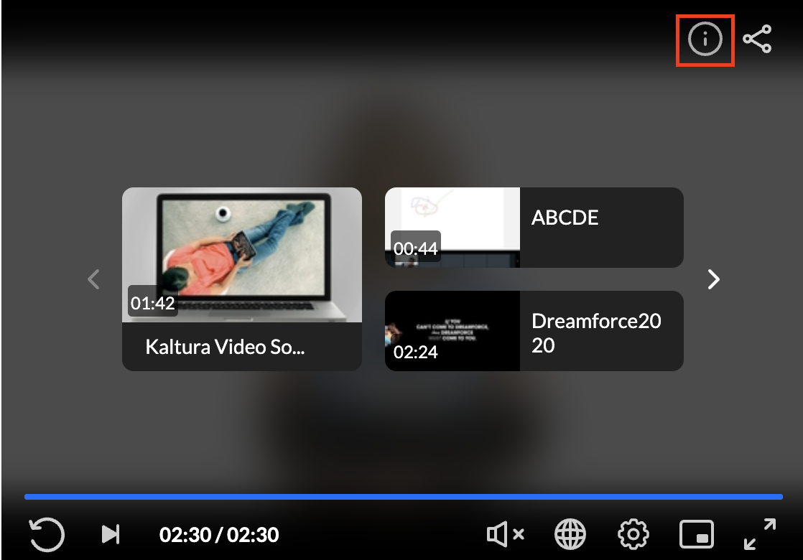
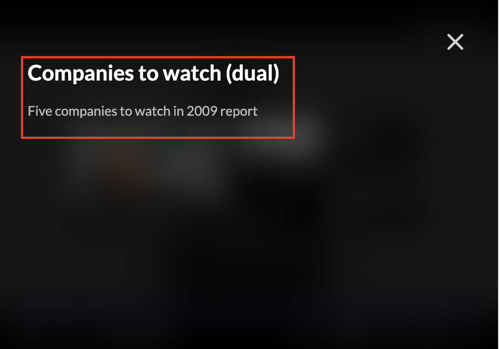

# PlayKit JS Info - plugin for the [PlayKit JS Player]

[](https://travis-ci.org/kaltura/playkit-js-info)
[](https://github.com/prettier/prettier)
[](https://www.npmjs.com/package/@playkit-js/info)
[](https://www.npmjs.com/package/@playkit-js/info/v/canary)

PlayKit JS Info is written in [ECMAScript6], statically analysed using [Typescript] and transpiled in ECMAScript5 using [Babel].

[typescript]: https://www.typescriptlang.org/
[ecmascript6]: https://github.com/ericdouglas/ES6-Learning#articles--tutorials
[babel]: https://babeljs.io

## Getting Started

### Prerequisites

The plugin requires [Kaltura Player] to be loaded first.

[kaltura player]: https://github.com/kaltura/kaltura-player-js

### Installing

First, clone and run [yarn] to install dependencies:

[yarn]: https://yarnpkg.com/lang/en/

```
git clone https://github.com/kaltura/playkit-js-info.git
cd playkit-js-info
yarn install
```

### Building

Then, build the player

```javascript
yarn run build
```

### Embed the library in your test page

Finally, add the bundle as a script tag in your page, and initialize the player

```html
<script type="text/javascript" src="/PATH/TO/FILE/kaltura-player.js"></script>
<!--Kaltura player-->
<script type="text/javascript" src="/PATH/TO/FILE/playkit-info.js"></script>
<!--PlayKit info plugin-->
<div id="player-placeholder" style="height:360px; width:640px">
  <script type="text/javascript">
    var playerContainer = document.querySelector("#player-placeholder");
    var config = {
     ...
     targetId: 'player-placeholder',
     plugins: {
       "playkit-js-info": {}
     }
     ...
    };
    var player = KalturaPlayer.setup(config);
    player.loadMedia(...);
  </script>
</div>
```

## Documentation

The info plugin purpose is to expose visual view of the entry information which is currently used by the player instead of digginf in the logs.

When the plugin is included on the player an info icon will be displayed and if user clicks on an overlay will be opened with the following data 
 
 * Entry Name
 * Entry Description          
 * Broadcasted Date - For webcast entries


### Configuration


In order to enable the plugin it should be mentioned in the plugins section on the uiconf or on player setup code. no special config required exept this.

#### Config Example

```
plugins: {
       "playkit-js-info": {}
}
```

#### UI Examples






### Example:

**[Info Plugin Example](https://codepen.io/giladna/pen/wvXBwwP)**


### Coding style tests

We use ESLint [recommended set](http://eslint.org/docs/rules/) with some additions for enforcing [Flow] types and other rules.

See [ESLint config](.eslintrc.json) for full configuration.

We also use [.editorconfig](.editorconfig) to maintain consistent coding styles and settings, please make sure you comply with the styling.

## Contributing

Please read [CONTRIBUTING.md](https://gist.github.com/PurpleBooth/b24679402957c63ec426) for details on our code of conduct, and the process for submitting pull requests to us.

## Versioning

We use [SemVer](http://semver.org/) for versioning. For the versions available, see the [tags on this repository](https://github.com/kaltura/playkit-js-info/tags).

## License

This project is licensed under the AGPL-3.0 License - see the [LICENSE.md](LICENSE.md) file for details
